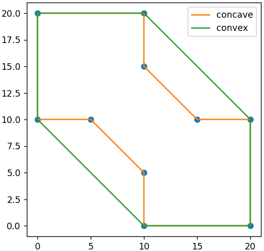

# Concave and convex hulls of points on a plane

## Installation

```bash
git clone --recursive https://github.com/vaidzelevich/hulls.git
pip install .
```

## Test call

```python
>>> from hulls import make_concave_hull, make_convex_hull
>>> points = [(10, 5), (10, 0), (20, 0), (20, 10), (15, 10),
... (10, 15), (10, 20), (0, 20), (0, 10), (5, 10)]
>>> make_concave_hull(points)
[[0.0, 10.0], [5.0, 10.0], [10.0, 5.0], [10.0, 0.0], [20.0, 0.0], 
[20.0, 10.0], [15.0, 10.0], [10.0, 15.0], [10.0, 20.0], [0.0, 20.0]]
>>> make_convex_hull(points)
[[0.0, 10.0], [10.0, 0.0], [20.0, 0.0], [20.0, 10.0], [10.0, 20.0], [0.0, 20.0]]
```

